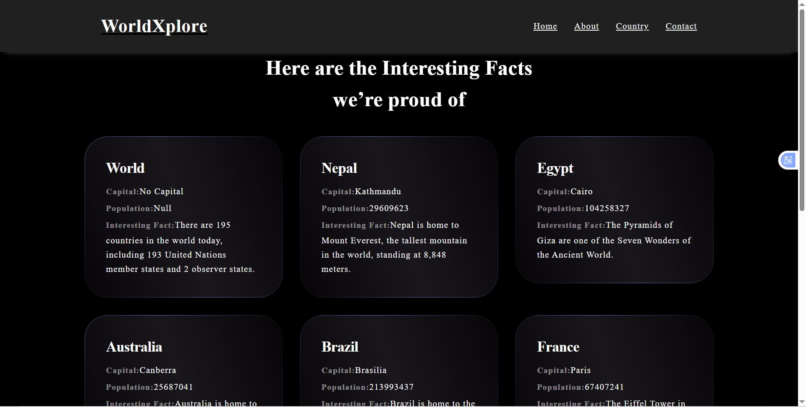
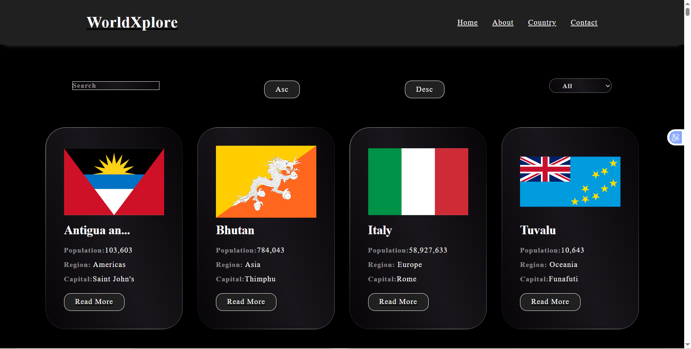
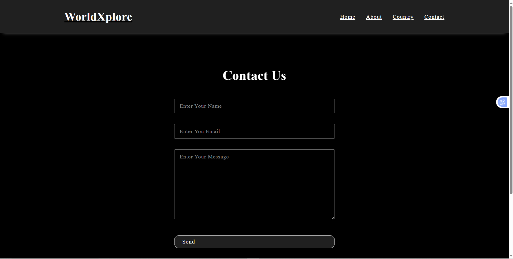
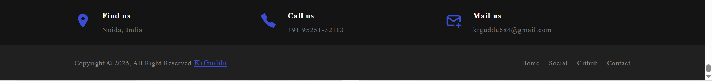

<h1 align="center">🌍 WorldXplore</h1>

<p align="center">
A modern React-based web application to explore detailed information about countries around the world.
</p>

---

## 🚀 Live Demo

🔗 https://worldxplore.netlify.app  

---

## 📂 GitHub Repository

🐙 https://github.com/KrGuddu/react_country.git

---

## 🧾 About This Project

WorldXplore is a modern web application that allows users to explore detailed information about countries across the globe.  
It presents essential country data such as official name, capital city, population, region, sub-region, and national flag in a clean and user-friendly interface.

This project demonstrates practical usage of **React**, **API integration**, and **responsive UI design**.

---

## ✨ Features

- 🌐 Explore countries from all over the world
- 🏳️ View national flags and official country names
- 🏙️ Capital city information
- 👥 Population statistics
- 🗺️ Region & sub-region details
- 🔍 Search and filtering functionality with ascending & descending order
- 📱 Fully responsive design for all devices
- ⚡ Fast and smooth user experience

---

## 🛠️ Tech Stack

- **Frontend:** React.js  
- **Styling:** CSS
- **API:** REST Countries API  
- **Build Tool:** Vite  
- **Deployment:** Netlify  

---

## 🌍 API Reference

This project uses the **REST Countries API** to fetch real-time country data:

🔗 https://restcountries.com/v3.1/all?fields=name,population,region,capital,flags

---

## 📸 Screenshots

### Home Page


### About Page


### Country Details Page


### Contact Page


### Footer


---

## ▶️ Run This Project Locally

```bash
# Clone the repository
git clone https://github.com/KrGuddu/react_country.git

# Navigate to the project directory
cd react_country

# Install dependencies
npm install

# Start the development server
npm run dev

```

## 👨‍💻 Author
**Mr. Guddu Kumar**  
Frontend / React Developer

🌐 Portfolio: https://guddudev.netlify.app

🐙 GitHub: https://github.com/KrGuddu
